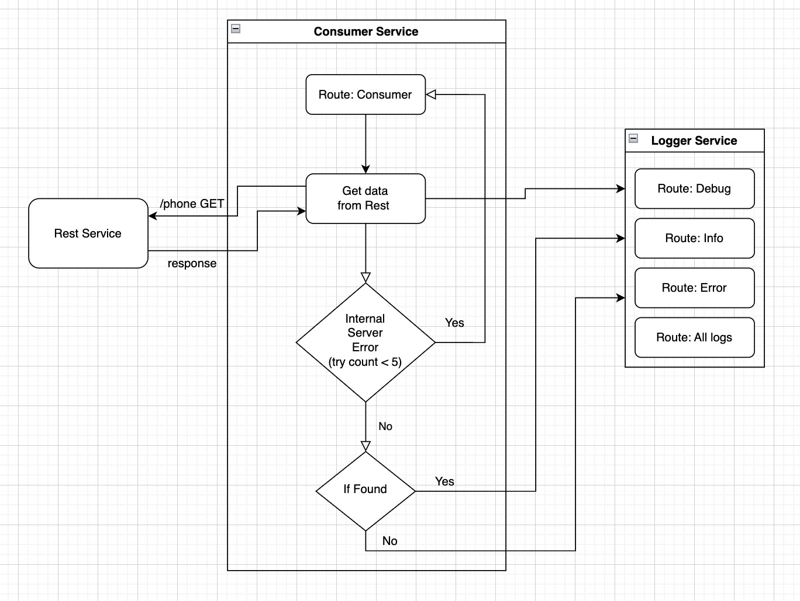

# TASK


Описание сервисов
1. [REST SERVICE](https://github.com/Mirobidjon/rest_service) Хранилище - номера телефонов (ID/Phone)
2. [CONSUMER SERVICE](https://github.com/Mirobidjon/consumer_service) Консьюмер - получает номера телефонов из хранилища и отправляет их в логгер
3. [LOGGER SERVICE](https://github.com/Mirobidjon/logger_service) Хранит 4 RMQ consumerа, слушающих очереди, в которые маршрутизует. Сообщения различаются уровнем логирования


# Deployment with kubernetes

### If you use minikube and macos m1 you can run this command for run

```bash
make apply-macos
```

Get kubernetes services 

```bash
kubens microservices

kubectl get svc
```

Rest service swagger
```bash
http://127.0.0.1:8080/swagger/index.html
```

RabbitMQ management admin panel, you can use guest/guest
```bash
http://127.0.0.1:15672/
```


### If you use minikube and linux you have to install k3d and run this command for run

```bash
make apply-linux
```